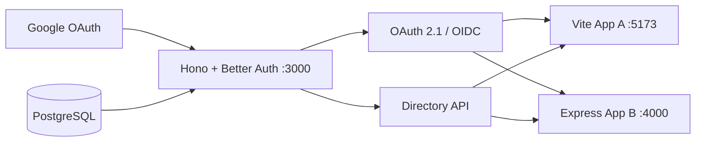

# SMZ Identity and single-school directory

A persistent first-party identity provider for one school:

- **Identity service:** Hono + Better Auth + `@better-auth/oauth-provider`
- **Persistence:** PostgreSQL + Drizzle, split into `auth` and `directory` schemas
- **Upstream login:** Google only, exact verified email, pre-approved adults only
- **App A:** Vite/React public OIDC client using Authorization Code + PKCE S256
- **App B:** Express confidential OIDC client using Authorization Code + PKCE S256 and a local server session
- **Authorization context:** live `GET /api/directory/v1/me/access-context`; roles and relationships are not embedded in ID tokens



## Local setup

Requires Node.js 22+ and Docker.

```bash
cp .env.example .env
npm install
docker compose up -d
npm run db:migrate
npm run directory:seed
npm run directory:seed -- --apply
npm run dev
```

`directory:seed` is a dry-run unless `--apply` is present. The committed file is placeholder-only. For real school data, copy it to `packages/auth-server/seeds/directory.seed.private.json`; private seed files are ignored.

Open:

- Auth service: http://localhost:3000
- OIDC discovery: http://localhost:3000/api/auth/.well-known/openid-configuration
- App A: http://localhost:5173
- App B: http://localhost:4000
- Health: http://localhost:3000/health

### Tailscale development access

The apps bind to all interfaces, so a tailnet device can use the node's raw
Tailscale IPv4 address on the usual ports (`3000`, `4000`, and `5173`). Cross-app
links retain that IP address. OAuth specifications and the provider reject raw-IP
callbacks, so starting sign-in from an IP URL intentionally returns to the
matching HTTPS MagicDNS app URL.

For a complete OIDC/Google flow, use a Tailscale HTTPS MagicDNS hostname instead
of a raw IP address. Google and the OAuth provider require HTTPS for a non-local
issuer. Set `TAILSCALE_HOST`, set `AUTH_ISSUER` to its HTTPS Auth URL, and expose
the three local services on separate Tailscale HTTPS ports, for example:

```bash
tailscale serve --https=8443 --bg http://127.0.0.1:3000
tailscale serve --https=8444 --bg http://127.0.0.1:4000
tailscale serve --https=8445 --bg http://127.0.0.1:5173
```

Set the matching `TAILSCALE_AUTH_PORT`, `TAILSCALE_APP_B_PORT`, and
`TAILSCALE_APP_A_PORT`; re-run `npm run directory:seed -- --apply`; then register
`https://<magicdns-host>:<auth-port>/api/auth/callback/google` in Google Cloud.
Cross-app links retain the MagicDNS host and use those HTTPS ports.

## Google setup

Create a Google OAuth **Web application** client and register this exact redirect URI:

```text
http://localhost:3000/api/auth/callback/google
```

Add its client ID and secret to `.env`. The directory seed must already contain an active adult with the same normalized email, an active invitation, and active access to the requested app. Unknown, unverified, expired, disabled, student, and app-revoked identities are denied.

The service requests only `openid profile email` from Google with online access. Google token material is encrypted at rest and is never returned to App A or App B.

## Seed format and lifecycle

The schema is [directory.seed.schema.json](/Users/harryworld/Developer/smzwaldorf/smz-auth/packages/auth-server/seeds/directory.seed.schema.json); the runnable placeholder is [directory.seed.example.json](/Users/harryworld/Developer/smzwaldorf/smz-auth/packages/auth-server/seeds/directory.seed.example.json).

The seed validates all IDs and cross-references before opening a transaction. Re-applying it is idempotent. Disabling a person removes Google linkage, sessions, consents, access tokens, and refresh tokens. Revoking one app removes that person/client pair’s consents and OAuth tokens. The directory API also checks PostgreSQL on every request, so lifecycle changes block access immediately even before a JWT expires.

## Verification

```bash
npm run typecheck
npm test
npm run test:integration -w @smz/auth-server
npm run build
```

The integration suite expects the local PostgreSQL container and covers repeat seed application, live dual-role scope resolution, inactive memberships, and immediate app revocation. A real-Google smoke requires credentials and an approved email; no development bypass or demo identity is enabled.

See [Architecture](/Users/harryworld/Developer/smzwaldorf/smz-auth/docs/ARCHITECTURE.md) for ownership boundaries and the future `email-cms` contract.

Before any production release, follow the [production operations and PostgreSQL backup runbook](/Users/harryworld/Developer/smzwaldorf/smz-auth/docs/OPERATIONS.md). Production configuration fails closed when required secrets or HTTPS are missing, and App B stores sessions in PostgreSQL rather than process memory.
