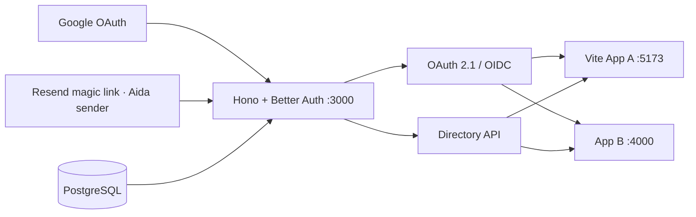

# SMZ Identity and single-school directory

Magic-link login now coexists with Google; see [setup and validation](docs/MAGIC-LINK.md). The hosted Cloudflare deployment uses the GitHub `staging` environment. `NODE_ENV=production` still enforces hosted security settings.

A first-party identity service for one school, with Node development entrypoints and Cloudflare deployment adapters: Pages for App A, Workers for Auth and App B, and PlanetScale Postgres through Hyperdrive.

Only Auth connects to the `smz-auth` logical database through Hyperdrive in the $5 `smzwaldorf` cluster. The cluster also contains the empty `smz-cms` logical database. App A and App B are database-free OAuth test clients. Enable `DEPLOY_DEMO_APPS=true` to publish them and register their exact production URLs through commit-triggered CI.

See [Cloudflare deployment](docs/CLOUDFLARE.md) for infrastructure configuration and the commit-triggered release workflow.

- **Identity service:** Hono + Better Auth + `@better-auth/oauth-provider`
- **Persistence:** PostgreSQL + Drizzle, split into `auth` and `directory` schemas
- **Upstream login:** Google plus optional magic links, exact approved email, pre-approved adults only
- **App A:** Vite/React public OIDC client using Authorization Code + PKCE S256
- **App B:** Hono confidential OIDC client using Authorization Code + PKCE S256 and an encrypted HttpOnly cookie session (legacy client ID `express-app`)
- **Authorization context:** live `GET /api/directory/v1/me/access-context`; roles and relationships are not embedded in ID tokens
- **School directory:** `GET /api/directory/v1/me/directory` adds scoped names, families, classes and memberships for application views. See [development school setup](docs/DEVELOPMENT-LOGIN.md#development-school-environment).



## Local setup

Requires Node.js 22+ and Docker.

```bash
cp .env.example .env
npm install
docker compose up -d
npm run db:migrate
npm run directory:seed
npm run directory:seed -- --apply
npm run dev
```

This setup is for local development and auth-flow review. the example secrets are local defaults; do
not expose these services as a production deployment.

`directory:seed` is a dry-run unless `--apply` is present. The committed file is placeholder-only. For real school data, copy it to `packages/auth-server/seeds/directory.seed.private.json`; private seed files are ignored.

Open:

- Application registrations: http://localhost:3000/admin/applications
- Directory administration (overview, users, students, families, classes): http://localhost:3000/admin ([access rules and operations](docs/ADMIN.md))
- Auth service: http://localhost:3000
- OIDC discovery: http://localhost:3000/api/auth/.well-known/openid-configuration
- App A: http://localhost:5173
- App B: http://localhost:4000
- Health: http://localhost:3000/health

## Google setup

Create a Google OAuth **Web application** client and register this exact redirect URI:

```text
http://localhost:3000/api/auth/callback/google
```

Add its client ID and secret to `.env`. The directory seed must already contain an active adult with the same normalized email, an active invitation, and active access to the requested app. Unknown, unverified, expired, disabled, student, and app-revoked identities are denied.

The service requests only `openid profile email` from Google with online access. Google token material is encrypted at rest and is never returned to App A or App B.

## Seed format and lifecycle

The schema is [directory.seed.schema.json](/Users/harryworld/Developer/smzwaldorf/smz-auth/packages/auth-server/seeds/directory.seed.schema.json); the runnable placeholder is [directory.seed.example.json](/Users/harryworld/Developer/smzwaldorf/smz-auth/packages/auth-server/seeds/directory.seed.example.json).

The seed validates all IDs and cross-references before opening a transaction. Re-applying it is idempotent. Disabling a person removes Google linkage, sessions, consents, access tokens, and refresh tokens. Revoking one app removes that person/client pair’s consents and OAuth tokens. The directory API also checks PostgreSQL on every request, so lifecycle changes block access immediately even before a JWT expires.

## Verification

```bash
npm run typecheck
npm test
npm run test:integration -w @smz/auth-server
npm run build
```

The integration suite expects the local PostgreSQL container and covers repeat seed application, live dual-role scope resolution, inactive memberships, and immediate app revocation. A real-Google smoke requires credentials and an approved email; no development bypass or demo identity is enabled.

See [Architecture](/Users/harryworld/Developer/smzwaldorf/smz-auth/docs/ARCHITECTURE.md) for ownership boundaries and the future `email-cms` contract.


## CMS registration and coordinated logout (2026-09-12)

Set production `CMS_ORIGIN=https://smz-cms.pages.dev` to enable the public `email-cms` client. Commit-triggered CI registers the exact `/auth/callback`, `/login` and `/logout/local` URLs with Authorization Code + PKCE and directory scopes. It does not import people or grant anyone application admission. CMS owns a separate uncached Hyperdrive to the `smz-cms` logical database on the existing cluster; Auth keeps its existing `smz-auth` binding.

The registered logout coordinator supports all enabled trusted clients, preserving App A/B aliases. It deletes the initiating central session's linked grants transactionally, leaves other devices' sessions intact, and verifies live session IDs on directory requests. Cleanup frames require exact registered origins and one-time state; unconfirmed cleanup is reported after 3.5 seconds. App A's deployed `/logout/local` headers permit only Auth framing. App B clears its cookie chunks and acknowledges Auth without following a caller redirect. Browser restrictions may prevent third-party local cleanup, but cannot restore central authorization.

Release validation includes PostgreSQL integration tests for CMS/App A/App B initiation, token and refresh rejection, other-device preservation, invalid returns and database failures. Production Google/browser verification remains a separate release check.

To connect a new website, open **Admin → Site access → Add application**. The setup page provides the OIDC configuration for browser or server apps. See [application setup](docs/ADMIN.md#add-an-application).

## Application admission policy (2026-09-14)

This supersedes earlier per-client and per-site grant descriptions in this document. All approved, active adult accounts automatically have access to all enabled registered applications, including new clients. Legacy app_access rows are ignored for admission. Account status, login approval, staging restrictions, and OAuth/application enabled flags remain enforced. Each consuming application owns its action permissions. Admin now lists applications and configures clients without per-user grant controls.

## Repeatable newsletter demo

See [the two-family demo guide](docs/DEMO-NEWSLETTER.md) for insert-only synthetic seeds and the Resend inbox test. `npm run seed:demo` prints a plan; `--check` rehearses with rollback and `--apply` writes only a new fixture.
