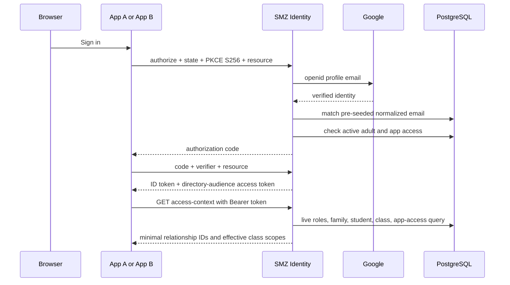

# Architecture

## Ownership

SMZ Identity owns authentication, adult/student identity records, school roles, family relationships, class memberships, and per-application admission. Applications receive a stable central `sub` and query the live directory API for current school context.

Applications still own action-level authorization and domain data. A `teacher` role or effective class scope is context, not permission to edit, publish, bill, deliver, or administer data in every app.

## Token and request flow

ID tokens contain stable identity claims only. Mutable roles, families, related students, and classes are resolved live. App A holds tokens in browser session storage. App B redeems and refreshes tokens server-side and maintains its own application session.

## Database schemas

- `auth`: Better Auth users, encrypted Google accounts, sessions, verification state, JWKS, OAuth clients, consents, access tokens, and refresh tokens.
- `directory`: people, multi-role assignments, families/memberships, classes/memberships, application registration mirror, per-person app access, login invitations, and append-only audit events.

An authenticating adult’s `directory.people.id`, Better Auth `auth.user.id`, and OIDC `sub` are the same UUID. Students have directory people rows but no auth user rows.

## Security boundaries

- Only seeded, trusted clients exist; dynamic registration is disabled.
- Authorization Code + PKCE S256 is required for public and confidential clients.
- Exact redirect URIs are stored in PostgreSQL.
- The Vite origin is read live from the registered application before CORS is granted.
- Access tokens require the canonical directory API URL audience and scope `directory:access`.
- Client secrets and OAuth tokens are stored hashed or encrypted; real seed data and `.env` are ignored.
- App/person lifecycle is checked at token issue/refresh and at every directory request.

Better Auth and its OAuth Provider use version 1.7.2. The directory API is a persisted OAuth resource, and every allowed client has an explicit resource link. Token issuance rejects other resources. The directory API verifies issuer, canonical audience URL, scope, authorized party, and live person/application access.

Cloudflare Pages serves App A. Two Workers run Auth and App B through request-scoped PostgreSQL pools backed by Hyperdrive and PlanetScale Postgres, with Hyperdrive query caching disabled. App B uses encrypted durable sessions in `auth.app_b_session` in its own `smz-app-b` database, with a separate Hyperdrive binding and secure host-only cookies. Auth uses `smz-auth`; all app databases use the `smz-` prefix. App A requires no database. The Node entrypoints share the same application factories.

The commit-triggered workflow validates all components. With `DEPLOY_DEMO_APPS=true` and App B's own database configuration, it registers both OIDC clients, ensures the Pages project exists, and publishes all three services. Client registration never imports example people or grants directory access. Direct sign-in visits without an application request return to the launcher. Production provisioning, migration-history checks, secret rotation, backups, and real-Google release checks are documented in [Cloudflare deployment](CLOUDFLARE.md).

## Future `email-cms` contract

`../email-cms` is intentionally unchanged. Its articles, newsletters, delivery state, and action permissions remain local.

A later migration may map the central `sub` to existing local users and have the backend call `GET /api/directory/v1/me/access-context`. That migration must preserve current local authorization/RLS until the backend-owned reader work and the cumulative `student_class_enrollment` schema are reconciled. Central school-directory ownership does not justify directly replacing current `auth.uid()` references or family foreign keys.
