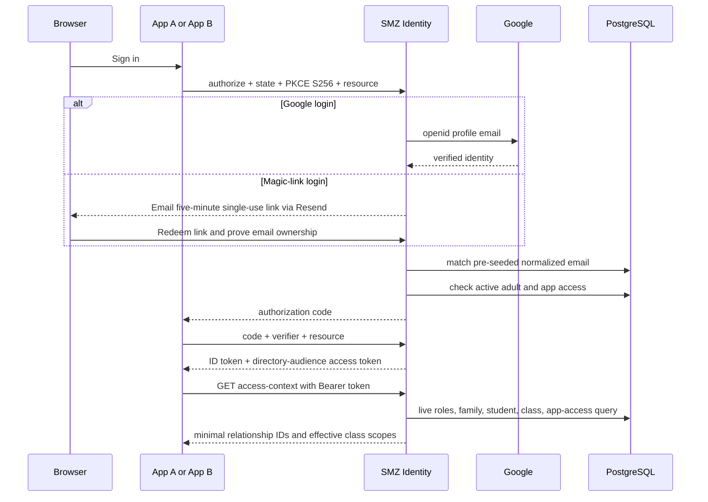

> Session update (2026-09-13): CMS now has a confidential `email-cms-server` client for its backend session. Its fixed admission mapping reuses the existing `email-cms` grant and additionally requires the server application to be enabled. No new person grants are created. The public client remains registered for old open tabs during cutover.

Magic-link login now coexists with Google; see [setup and validation](MAGIC-LINK.md). The hosted Cloudflare deployment uses the GitHub `staging` environment. `NODE_ENV=production` still enforces hosted security settings.
>
> Central sessions use a 30-day rolling lifetime. Verified directory use extends a still-live session at most daily; it cannot resurrect a deleted or expired session. Expired central sessions return `401 session_expired`, missing/deleted sessions and revoked admission return `403 access_revoked`, and infrastructure failures return `503 identity_unavailable`. Access tokens remain 15 minutes and refresh tokens 30 days. Rotating refresh tokens support a 120-second same-request replay window for lost responses.
>
> Hosted client registration reads `CMS_OIDC_CLIENT_SECRET` from the GitHub `staging` environment. CMS stores OAuth credentials encrypted in its own existing database and uses an opaque first-party HttpOnly cookie. Application identity retention is separate from active authorization.
>
> Local cross-repository validation: build CMS, then run `CMS_CHECKOUT=/absolute/cms/checkout DATABASE_URL=postgres://session_test@127.0.0.1:55444/smz_identity AUTH_ISSUER=http://localhost:55445/api/auth CMS_ORIGIN=http://localhost:55446 npx tsx scripts/cms-session-joint.ts` against the dedicated synthetic databases described by that script. It verifies PKCE/nonce, confidential admission, rotation after a lost response, concurrent requests, outage/recovery, expiry and explicit logout. No production credentials are used.

# Architecture

## Ownership

SMZ Identity owns authentication, adult/student identity records, school roles, family relationships, class memberships, and per-application admission. Applications receive a stable central `sub` and query the live directory API for current school context.

Applications still own action-level authorization and domain data. A `teacher` role or effective class scope is context, not permission to edit, publish, bill, deliver, or administer data in every app.

## Central user administration

The Auth service serves `/admin` using its existing Better Auth session. A live directory `admin` role plus current login eligibility authorizes directory user administration. Changes are transactional and audited; edits to other users revoke their central sessions and OAuth tokens. The `/admin/applications` view groups registrations by normalized site origin and manages access for all current login clients at a site. Site revocation removes those clients’ OAuth grants while preserving the central session and unrelated sites. Existing mixed grants remain visible as Partial until explicitly reconciled. The user editor uses the same groups; configuration fingerprints reject stale client membership. Runtime admission remains per-client, with the existing shared CMS admission mapping. The panel manages adult approval, roles, and application admission, while family/class relationships remain seed-managed. See [User administration](ADMIN.md) for access, constraints, and validation.

## Token and request flow

ID tokens contain stable identity claims only. Mutable roles, families, related students, and classes are resolved live. App A holds tokens in browser session storage. App B redeems and refreshes tokens server-side and maintains its own application session.

## Database schemas

- `auth`: Better Auth users, encrypted Google accounts, sessions, verification state, JWKS, OAuth clients, consents, access tokens, and refresh tokens.
- `directory`: people, multi-role assignments, families/memberships, classes/memberships, application registration mirror, per-person app access, login invitations, and append-only audit events.

An authenticating adult’s `directory.people.id`, Better Auth `auth.user.id`, and OIDC `sub` are the same UUID. Students have directory people rows but no auth user rows.

## Security boundaries

- Only seeded, trusted clients exist; dynamic registration is disabled.
- Authorization Code + PKCE S256 is required for public and confidential clients.
- Exact redirect URIs are stored in PostgreSQL.
- The Vite origin is read live from the registered application before CORS is granted.
- Access tokens require the canonical directory API URL audience and scope `directory:access`.
- Client secrets and OAuth tokens are stored hashed or encrypted; real seed data and `.env` are ignored.
- App/person lifecycle is checked at token issue/refresh and at every directory request.

Better Auth and its OAuth Provider use version 1.7.2. The directory API is a persisted OAuth resource, and every allowed client has an explicit resource link. Token issuance rejects other resources. The directory API verifies issuer, canonical audience URL, scope, authorized party, and live person/application access.

Cloudflare Pages serves App A; Workers run Auth and App B. Only Auth connects to PlanetScale through an uncached Hyperdrive pool. The `smzwaldorf` cluster contains the `smz-auth` and empty `smz-cms` logical databases. App A uses browser session storage. App B uses encrypted, expiring HttpOnly cookies and exchanges tokens server-side. Neither test client has database bindings or credentials. Both call Auth's directory API for access checks. The Node entrypoints share the application factories.

The commit-triggered workflow validates all components. With `DEPLOY_DEMO_APPS=true` and the Auth database configuration, it registers both OIDC clients, ensures the Pages project exists, and publishes all three services. Client registration never imports example people or grants directory access. Direct sign-in visits without an application request return to the launcher. Production provisioning, migration-history checks, secret rotation, backups, and real-Google release checks are documented in [Cloudflare deployment](CLOUDFLARE.md).

## Future `email-cms` contract

`../email-cms` is intentionally unchanged. Its articles, newsletters, delivery state, and action permissions remain local.

A later migration may map the central `sub` to existing local users and have the backend call `GET /api/directory/v1/me/access-context`. That migration must preserve current local authorization/RLS until the backend-owned reader work and the cumulative `student_class_enrollment` schema are reconciled. Central school-directory ownership does not justify directly replacing current `auth.uid()` references or family foreign keys.

## CMS registration and coordinated logout (2026-09-12)

Set production `CMS_ORIGIN=https://smz-cms.pages.dev` to enable the public `email-cms` client. Commit-triggered CI registers the exact `/auth/callback`, `/login` and `/logout/local` URLs with Authorization Code + PKCE and directory scopes. It does not import people or grant anyone application admission. CMS owns a separate uncached Hyperdrive to the `smz-cms` logical database on the existing cluster; Auth keeps its existing `smz-auth` binding.

The registered logout coordinator supports all enabled trusted clients, preserving App A/B aliases. It deletes the initiating central session's linked grants transactionally, leaves other devices' sessions intact, and verifies live session IDs on directory requests. Cleanup frames require exact registered origins and one-time state; unconfirmed cleanup is reported after 3.5 seconds. App A's deployed `/logout/local` headers permit only Auth framing. App B clears its cookie chunks and acknowledges Auth without following a caller redirect. Browser restrictions may prevent third-party local cleanup, but cannot restore central authorization.

Release validation includes PostgreSQL integration tests for CMS/App A/App B initiation, token and refresh rejection, other-device preservation, invalid returns and database failures. Production Google/browser verification remains a separate release check.

Administrator-created application clients are registered transactionally through the site admin panel, with exact same-site callback URLs, PKCE, and directory resource permission. Browser trusted origins and launcher entries read enabled registrations at runtime. Registration never grants user admission; site access remains an explicit administrator action. Confidential client secrets are displayed once and persisted only as hashes.

## Application admission policy (2026-09-14)

This supersedes earlier per-client and per-site grant descriptions in this document. All approved, active adult accounts automatically have access to all enabled registered applications, including new clients. Legacy app_access rows are ignored for admission. Account status, login approval, staging restrictions, and OAuth/application enabled flags remain enforced. Each consuming application owns its action permissions. Admin now lists applications and configures clients without per-user grant controls.
